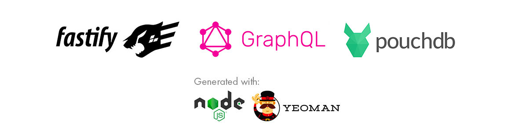
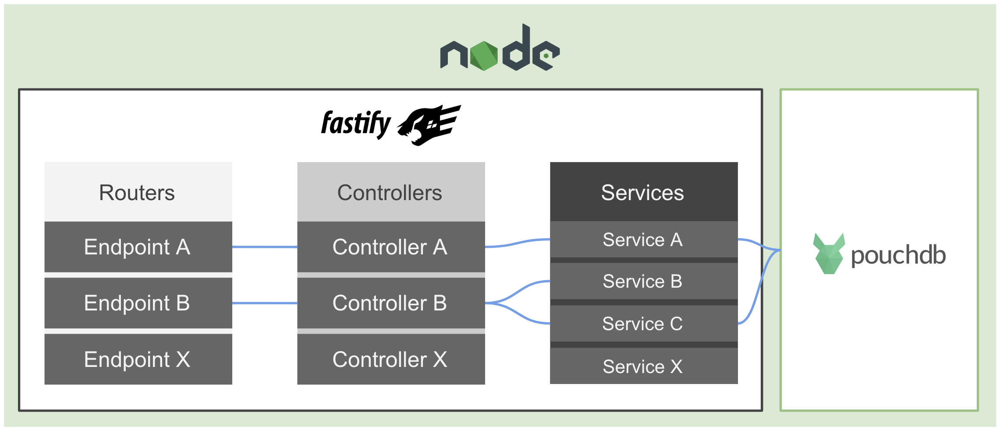
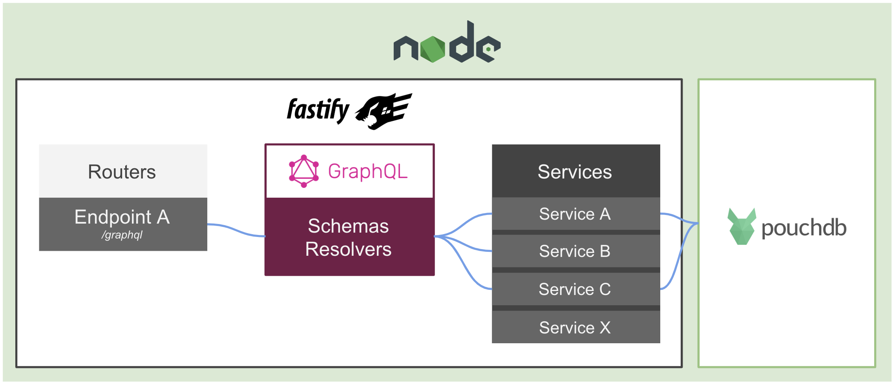
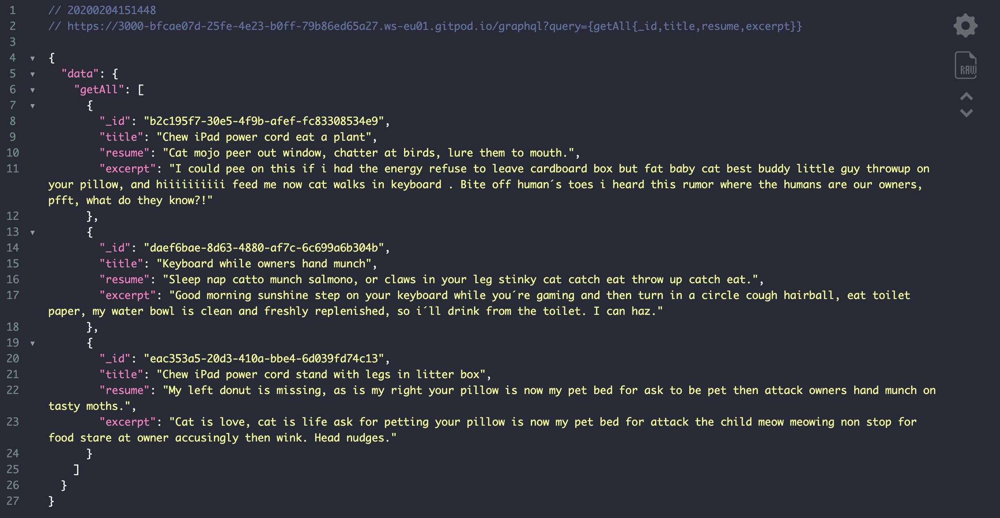
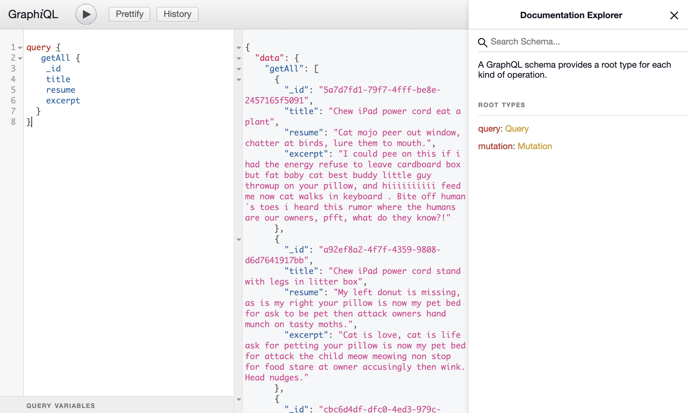

# Tutorial Fastify with GraphQL and PouchDB

[](https://github.com/RichardLitt/standard-readme)
[](https://twitter.com/JoseJ_PR)



## 🔖 Description

REST API and GraphQL Project for NodeJS Application.

The project strucutre has been created with Yeoman and Generator Standard REST API Projects.

* [Yeoman](https://yeoman.io/)
* [Yeoman | Generator Standard REST API Projects](https://github.com/JoseJPR/yeoman-generator-rest-api-projects)

## 📌 Methodologies and Guidelines

List of methodologies and tools used in this project for compliance with Quality Assurance Code (QAC)

* TypeScript, These projects provide templates which include TypeScript support. \
  [NPM TypeScript](https://www.npmjs.com/package/typescript)
* ESTlint, tool for identifying and reporting on patterns found in ECMAScript/JavaScript code. \
  [NPM ESLint](https://www.npmjs.com/package/eslint) \
  [NPM ESLint | Airbnb](https://www.npmjs.com/package/eslint-config-airbnb)
* Jest, delightful JavaScript Testing. \
  [NPM Jest](https://www.npmjs.com/package/jest)
* SuperTest, HTTP assertions made easy via superagent. \
  [NPM SuperTest](https://www.npmjs.com/package/supertest)
* Mozilla, Standard HTTP response status codes. \
  [HTTP Status MOZILLA](https://developer.mozilla.org/es/docs/Web/HTTP/Status)

## ⚡️ Technologies and Tools

The main libraries and tools used in this project are:

* [Fastify](https://www.fastify.io/)
* [GraphQL](https://graphql.org/)
* [PouchDB](https://pouchdb.com/)

## ✅ Prerequisites

In order to work with this project, your local environment must have at least the following versions:

* NodeJS Version: 12.xx
* NPM Version: 6.12.0

## Workflow HTTP REST API

With these two graphs I want to expose the life cycle when we use the endpoints with GraphQL and without it.

**Fastify and PouchDB**


**Fastify, GraphQL and PouchDB**


## 📐 How to work with this project

You have to do the following steps to be able to work with this project.

### 1️⃣ Install NodeJS Dependencies
To work with this project locally and to be able to deploy in different environments, it is necessary to install the NPM dependencies.

```bash
# Install npm dependencies
$npm i
```

### 2️⃣ Development

To add the seed for /articles endpoints you will have to execute the following command:

```bash
# Seed
$npm run create:seed
```

To run the project locally and to develop you will have to execute the following command _(You will see a message on your terminal with the address and port of the local server)_:

```bash
# Run
$npm run start:watch
```

To run the unit tests of this project you will have to execute the following command:

```bash
# Tests
$npm run test
```

### 3️⃣ GraphQL

#### 🔗 To work with HTTP request from other project (for example Frontend ReactJS project) and work with GraphQL, use the following url:

> Base url for http request to graphpl endpoint. \
  http://localhost:3000/graphql \
  Example for get all articles from seed of PouchDB. \
  http://localhost:3000/graphql?query={getAll{_id,title,resume,excerpt}}



#### 🔮 If you want to work with the GraphiQL IDE in your browser you can, use the following url:

> Base url GraphiQL IDE. \
  http://localhost:3000/graphql



## 🔌 Enviroments files

If you have selected one or more environments you will see an env file for each environment that you can modify. The complete list of the .env files that you should have in the "env" folder should be:

* .env.local

## 📂 Code scaffolding

```any
/
├── assets 🌈               # Images Sources.
├── doc
|   ├── api 🚠              # Api Versions.
|   ├── qac 🔰              # Quality Assurance Code.
├── env 🔌                  # Configure enviroments deploy.
├── src
|   ├── __mocks__ 👻        # Mocks data for test.
|   ├── __tests__ 🚥        # Unit tests.
|   ├── config              # Generic config.
|   ├── controllers         # Controllers.
|   ├── libs                # Custom libreries and tools.
|   ├── routes              # Routes.
|   ├── services            # Services.
|   ├── types               # TypeScript types.
|   └── ...
└── ...
```

## 📦 Core and Libraries

This project is based on the Fastify framework as a core for the development of the project structure and with custom libraries.

## ⛽️ Review and Update Dependences

For review and update all npm dependences of this project you need install in global npm package "npm-check-updates" npm module.

```bash
# Install and Run
$npm i -g npm-check-updates

# Run library to check npm modules
$ncu
```

## Happy Code

Created with JavaScript, lot of ❤️ and a few ☕️

## This README.md file has been written keeping in mind

* [GitHub Markdown](https://guides.github.com/features/mastering-markdown/)
* [Emoji Cheat Sheet](https://www.webfx.com/tools/emoji-cheat-sheet/)
