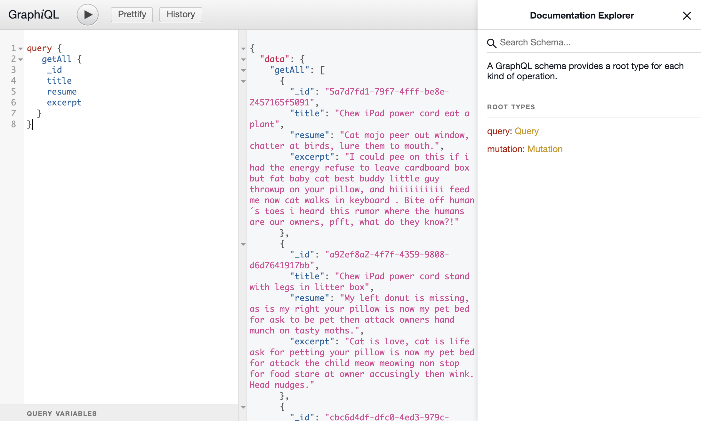

# 🔮 API Documentation | GraphiQL

## Description

GraphiQL is the reference implementation of this monorepo, GraphQL IDE, an official project under the GraphQL Foundation.

## You can to work with the GraphiQL IDE in your browser

> Base url GraphiQL IDE. \
  http://localhost:3000/graphiql



## Working with Fastify and GraphQL

### Get All Articles

**Query**
```js
query {
   getAll {
    _id
    title
    resume
    excerpt
  }
}
```

### Get Article by ID

**Query**
```js
query ($_id:ID!) {
  getOne (_id:$_id) {
    _id
    title
    resume
    excerpt
  }
}
```
**Variables**
```js
{
  "_id": "5dd04cf0-0b7c-4021-ab16-803436a5aa46"
}
```

### Create Article

**Query**
```js
mutation ($input: ArticleInput!) {
  create (input: $input) {
    _id
    title
    resume
    excerpt
  }
}
```
**Variables**
```js
{
  "input": {
    "title": "Test Title",
  	"resume": "Test Resume",
  	"excerpt": "Test Excerpt"
  }
}
```

### Update Article by ID

**Query**
```js
mutation ($_id: ID!, $input: ArticleInput!) {
  update (_id: $_id, input: $input) {
    _id
    title
    resume
    excerpt
  }
}
```
**Variables**
```js
{
  "_id": "5dd04cf0-0b7c-4021-ab16-803436a5aa46",
  "input": {
    "title": "Test New Title",
  	"resume": "Test New Resume",
  	"excerpt": "Test New Excerpt"
  }
}
```

### Delete Article by ID

**Query**
```js
mutation ($_id: ID!) {
  delete (_id: $_id) {
    ok
    id
  }
}
```
**Variables**
```js
{
  "_id": "5dd04cf0-0b7c-4021-ab16-803436a5aa46"
}
```

## 🎁 Bonus: You can use Alias and Fragments too

**Alias**
```any
query {
  allWithTitleAndResume: getAll {
    title
    resume
  }
  allWithTitleAndExcerpt: getAll {
    title
    excerpt
  }
}
```

**Fragments**
```any
query {
  first: getOne (
    _id: "0f3ab5f7-8e71-4cfb-ae43-e34885453bbd"
  ) {
    ...articleFragment
  }
  second: getOne (
    _id: "0f3ab5f7-8e71-4cfb-ae43-e34885453bbd"
  ) {
    ...articleFragment
  }
}

fragment articleFragment on Article {
  _id
  title
  resume
  excerpt
}
```